# 🕹️ Die Zockerstube
> **Community First // Enthusiast Driven**

[](https://zockerstube.github.io/)
[](LICENSE)
[](https://discord.gg/zockerstube)
[](https://developer.mozilla.org/en-US/docs/Web/JavaScript)

Willkommen in der digitalen Schaltzentrale der **Zockerstube**. Dies ist kein gewöhnliches Repository — es ist das Fundament eines „Community-First“ Projekts für Nerds, Geeks und Gamer.

---

## 📋 Table of Contents
- [COMMUNITY_CORE.sys](#-community_coresys)
- [The Architects](#-the-architects-founder-bios)
- [Technical Blueprint](#-technical-blueprint)
- [Community Flow](#-community-flow)
- [Installation & Nutzung](#-installation--nutzung)
- [Legal & Privacy](#-legal--privacy)

---

## 🧠 COMMUNITY_CORE.sys
**Mehr als nur ein Server.**

Die **Zockerstube** ist ein Projekt, das zeigt, dass großartige Gemeinschaften nicht auf teuren Abos basieren, sondern auf ehrlichem Austausch und Leidenschaft.

> [!IMPORTANT]
> **Unsere Philosophie:** Wir verzichten bewusst auf generische SaaS-Bots und setzen auf **Open-Source** sowie selbst entwickelte Lösungen. Das gibt uns maximale Kontrolle über unsere Features und schützt die Privatsphäre unserer Mitglieder.

---

## 🛡️ The Architects (Founder Bios)

| Founder | Role | Description |
| :--- | :--- | :--- |
| **Mr.Riös** | Technical Soul | Stratege und Architekt. Liebt komplexe Systeme, logische Perfektion und EVE Online. |
| **Mrs.Crunch** | Creative Heart | Design-Leitung. Verwandelt Logik in Ästhetik und sorgt für den perfekten Vibe. |

---

## ⚙️ Technical Blueprint

### Der Tech-Stack
Die Zockerstube basiert auf dem **KISS-Prinzip** (Keep It Simple, Stupid), kombiniert mit moderner Web-Technologie:

*   **HTML5 & Vanilla CSS**: Reine Performance ohne Build-Step Overhead.
*   **Vanilla JS**: Robuste Logik, die auch in 10 Jahren noch läuft.
*   **FontAwesome v6**: Stabile und konsistente Icon-Einbindung.
*   **Hardware Acceleration**: GPU-beschleunigte 3D-Kipp-Effekte und Gitter-Animationen.

### Rendering-Optimierungen
| Feature | Technik | Nutzen |
| :--- | :--- | :--- |
| **LCP Optimization** | `fetchpriority="high"` | Instant-Laden des Hero-Bereichs. |
| **Lazy Loading** | `IntersectionObserver` | Proaktives Laden von Sektionen 200px vor Sicht. |
| **Main Layer** | `content-visibility: auto` | Schnellerer Initialaufbau durch Render-Skipping. |

---

## 🚦 Community Flow
Wie wird man Teil der Stube?

```mermaid
graph TD
    A["🚪 GUEST (Start)"] --> B["📜 RULES_V1 (Check)"]
    B --> C{"✅ Accepted?"}
    C -- "No" --> D["❌ Rejected"]
    C -- "Yes" --> E["🏷️ INTERESTS (Nerdforum)"]
    E --> F["🛡️ MEMBER (Verified)"]
    
    style A fill:#1e293b,stroke:#00FFFF,stroke-width:2px,color:#fff
    style F fill:#1e293b,stroke:#22c55e,stroke-width:2px,color:#fff
    style B fill:#1e293b,stroke:#bd00ff,stroke-width:2px,color:#fff
```



---

## 🚀 Installation & Nutzung

1.  **Clone the Repository**:
    ```bash
    git clone https://github.com/Zockerstube/zockerstube.git
    ```
2.  **Open Index**: Einfach die `index.html` im Browser öffnen.
3.  **Local Dev**: Für automatische Refreshes empfehlen wir `Live Server` (VS Code Extension).

> [!TIP]
> Die Seite benötigt keinen Server und keine Datenbank. Sie ist zu 100% statisch und sicher.

---

## 🛡️ Legal & Privacy

Dieses Projekt ist anonymisiert. Der „Impressum“-Bereich auf der Website wurde so angepasst, dass die Privatsphäre der Community gewahrt bleibt, während wir für Support & Kontakt über unseren Discord erreichbar sind.

---

*Coded with ❤️ and Synthwave by Mr.Riös & Mrs.Crunch // 2026*
